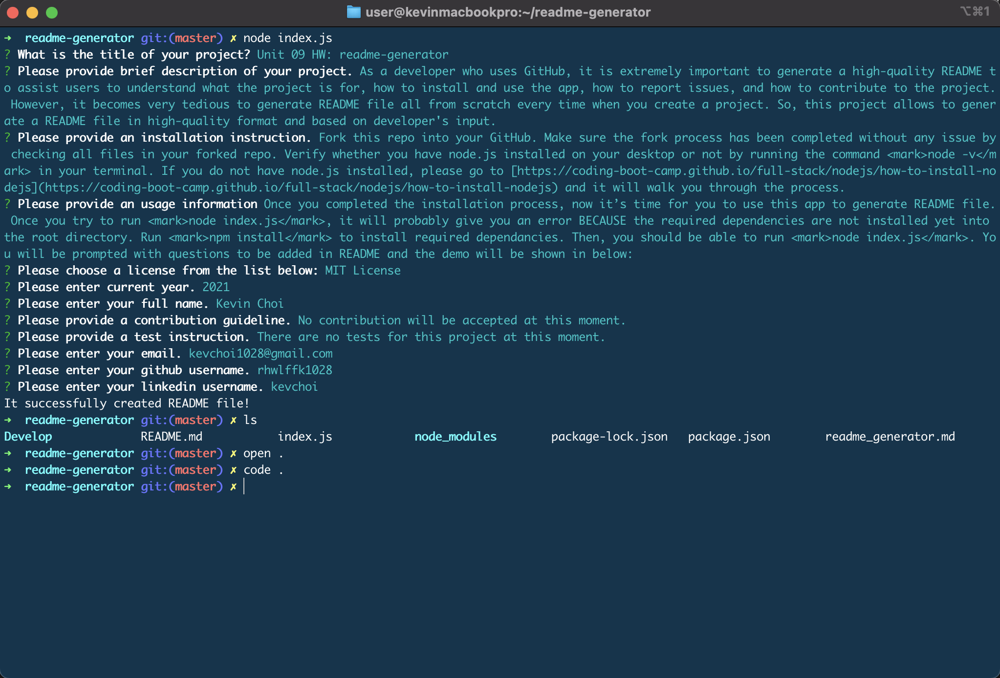

# Unit 09 HW: readme-generator

  [](https://opensource.org/licenses/MIT)

  ## Description
  As a developer who uses GitHub, it is extremely important to generate a high-quality README to assist users to understand what the project is for, how to install and use the app, how to report issues, and how to contribute to the project. However, it becomes very tedious to generate README file all from scratch every time when you create a project. So, this project allows to generate a README file in high-quality format and based on developer's input.

  ## Table of Contents
  * [Installation](#installation)
  * [Usage](#usage)
  * [License](#license)
  * [Contributing](#contributing)
  * [Tests](#tests)
  * [Questions](#questions)
 
  ## Installation
  Fork this repo into your GitHub. Make sure the fork process has been completed without any issue by checking all files in your forked repo. Verify whether you have node.js installed on your desktop or not by running the command <mark>node -v</mark> in your terminal. If you do not have node.js installed, please go to [https://coding-boot-camp.github.io/full-stack/nodejs/how-to-install-nodejs](https://coding-boot-camp.github.io/full-stack/nodejs/how-to-install-nodejs) and it will walk you through the process.

  ## Usage
  Once you completed the installation process, now it’s time for you to use this app to generate README file. Once you try to run <mark>node index.js</mark>, it will probably give you an error BECAUSE the required dependencies are not installed yet into the root directory. Run <mark>npm install</mark> to install required dependancies. Then, you should be able to run <mark>node index.js</mark>. You will be prompted with questions to be added in README and the demo will be shown in below:

  

  
  
  ## License
  This project is covered under MIT License.

  <details>
    <summary>
      See License
    </summary> 
  
  ```
  Copyright <2021> <Kevin Choi>

  Permission is hereby granted, free of charge, to any person obtaining a copy of this software and associated documentation files (the "Software"), to deal in the Software without restriction, including without limitation the rights to use, copy, modify, merge, publish, distribute, sublicense, and/or sell copies of the Software, and to permit persons to whom the Software is furnished to do so, subject to the following conditions:
  The above copyright notice and this permission notice shall be included in all copies or substantial portions of the Software.
  
  THE SOFTWARE IS PROVIDED "AS IS", WITHOUT WARRANTY OF ANY KIND, EXPRESS OR IMPLIED, INCLUDING BUT NOT LIMITED TO THE WARRANTIES OF MERCHANTABILITY, FITNESS FOR A PARTICULAR PURPOSE AND NONINFRINGEMENT. IN NO EVENT SHALL THE AUTHORS OR COPYRIGHT HOLDERS BE LIABLE FOR ANY CLAIM, DAMAGES OR OTHER LIABILITY, WHETHER IN AN ACTION OF CONTRACT, TORT OR OTHERWISE, ARISING FROM, OUT OF OR IN CONNECTION WITH THE SOFTWARE OR THE USE OR OTHER DEALINGS IN THE SOFTWARE.
  ```
  </details>
  

  ## Contributing
  No contribution will be accepted at this moment.

  ## Tests
  There are no tests for this project at this moment.

  ## Questions
  If you have any questions, please contact me via

  * Email: [kevchoi1028@gmail.com](mailto:kevchoi1028@gmail.com)

  * GitHub: [https://github.com/rhwlffk1028](https://github.com/rhwlffk1028)

  * Linkedin: [https://linkedin.com/in/kevchoi](https://linkedin.com/in/kevchoi)